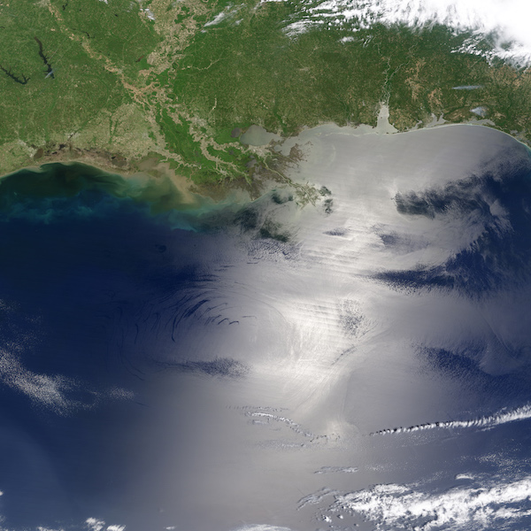

 

  

 

**Course overview**  

The primary goal of the Open Science for Synthesis: Gulf Research Program Workshop is to provide hands-on experience with contemporary open science tools from command line to data to communication. Team science is promoted. Practice and real data are used in groups to apply skills we explore.

**Week 1.** Fundamental collaboration skills  
Introduction to command line, communicating science, R, meta-analysis and data management.  

**Week 2.** Advanced topics  
Tabular data, programming, Python, workflows, reproducible science and metagenomics.  

**Week 3.** Advanced topics & group projects  
Communication, geospatial analysis, data viz, and group project sharing.

All participants detail listed [here](https://www.nceas.ucsb.edu/OSS2017).

Discussion on [Slack OSS channel](https://nceas.slack.com/messages/C4UHC7K17).

If you aren't already a member of the Slack team, you need to [invite yourself](http://slack.nceas.ucsb.edu/).

