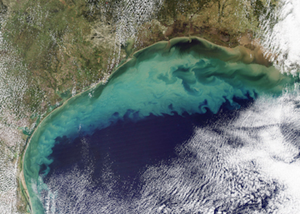

 

  

 

**Course overview**  

The primary goal of the Open Science for Synthesis Workshop is to provide hands-on experience with contemporary open science tools from command line to data to communication. Team science is promoted. Practice and real data are used in groups to apply skills we explore.

**Week 1.** Fundamental collaboration skills  
Introduction to command line, communicating science, R, and data management.  

**Week 2.** Advanced topics  
Meta-analysis, tabular data, programming, Python, and geospatial data.  

**Week 3.** Advanced topics & group projects  
Metagenomics, communication, geospatial analysis, data viz, and group project sharing.

All participants detail listed [here.](https://www.nceas.ucsb.edu/OSS2017)  
Discussion on [slack oss channel](https://nceas.slack.com/messages/C4UHC7K17)

